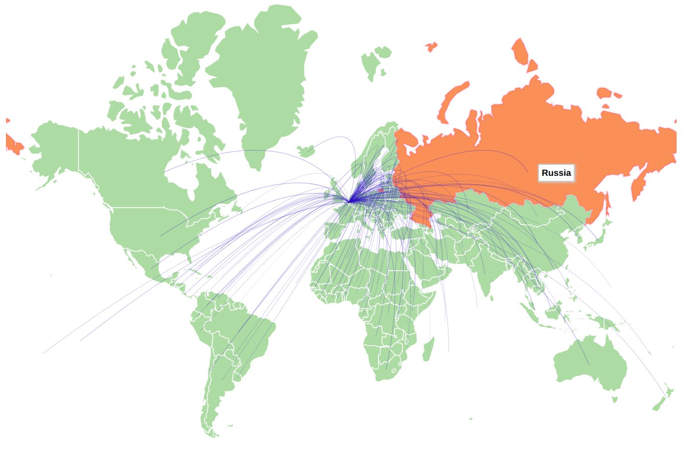
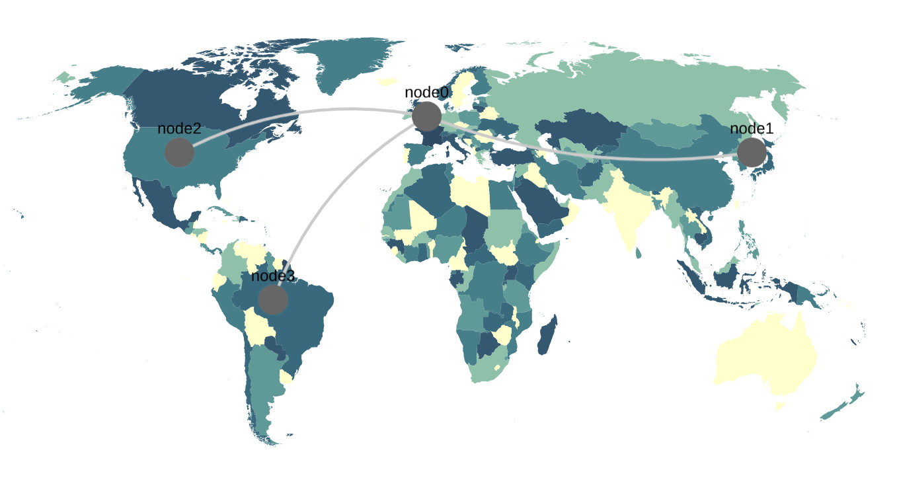
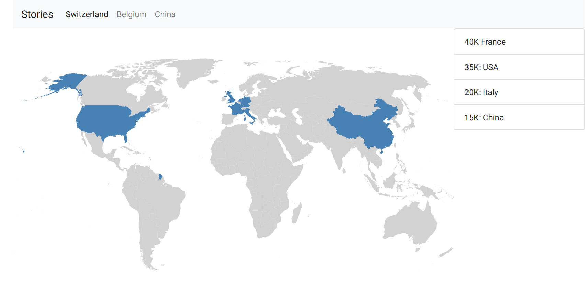

# Process Book

## Project Proposal

### Overview
How have some countries' most typical food exports evolved over time?

Food exports allowed people to have access to the most iconic foods and beverages of every countries in the world. The evolution of those trades is interesting for the general public: who has never tried Swiss chocolate, or Chinese tea?

Some of these products have become more popular over time, like Quinoa, or Belgian beer. Can we see a clear trend? Maybe a map can help us find out.

The scope of the project is to visualise the exportation of some countries' specialties over the years, in an interactive map.

### Related Work and Inspiration:
The map we want to build will look like this : https://resourcetrade.earth/

We will focus on a small amount of (country, product) pairs that are interesting, and will keep 3-5 different time periods that make sense and possibly show an nice evolution in the trades.

## Dataset Preporcessing and first visualisation

## Second map version
Following our discussion with the professor, we implemented a new version of our map based on

### Implementation of Cytoscape

### Bootstrap and html

### Timeline creation

### Tooltips and interactions

## Further things to do

